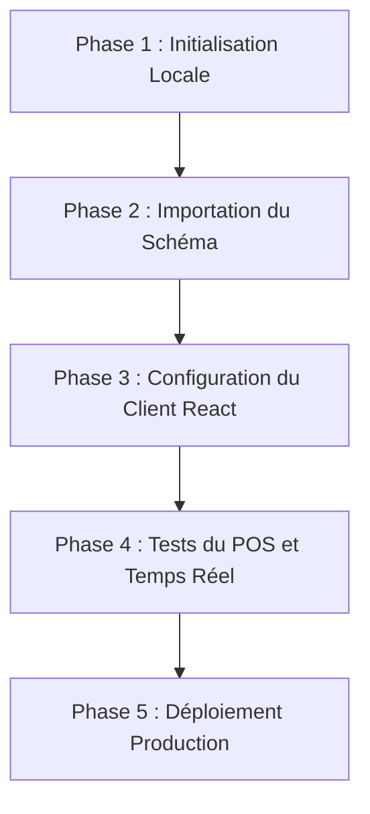

# 📓 Journal de Bord : Migration de la Base de Données (AIPOS)

Ce document retrace toutes les étapes de la migration de la base de données AIPOS pour passer de **Supabase Cloud (Payant)** à un **Supabase Auto-Hébergé (Gratuit et Local)**. Il contient le plan de migration détaillé, le suivi de l'avancement et les étapes restantes.

---

## 🗺️ Plan Complet de la Migration

### Phase 1 : Initialisation & Démarrage de Supabase Local
*   [x] Vérification de la disponibilité de Docker sur la machine locale.
*   [x] Installation locale du CLI Supabase (via `npx`).
*   [x] Correction des paramètres obsolètes du fichier `supabase/config.toml` (inbucket ➡️ local_smtp, ip_version, suppression des ports internes obsolètes).
*   [x] Lancement des conteneurs locaux Supabase (`npx supabase start`).

### Phase 2 : Importation et Validation du Schéma (Triggers & RPC)
*   [x] Application automatique des 518 fichiers de migration SQL de `supabase/migrations`.
*   [x] Validation de la création des 98 tables.
*   [x] Validation des procédures stockées (RPC).
*   [x] Validation des Triggers SQL.

### Phase 3 : Connexion du Frontend React / Capacitor
*   [x] Création/Mise à jour du fichier `.env` à la racine pour pointer vers l'URL locale (`http://localhost:54321`) et l'anon key locale.
*   [x] Modification de la configuration dans `src/integrations/supabase/client.ts` pour charger les variables locales.
*   [x] Vérification des dépendances et démarrage du serveur de développement (`npm run dev`).

### Phase 4 : Recette & Tests du POS
*   [ ] Test du flux de connexion utilisateur (par mot de passe et par code PIN).
*   [ ] Test de création de commandes et d'articles de commande (POS).
*   [ ] Test du temps réel (Realtime) et du mécanisme de présence sur la timeline des réservations.
*   [ ] Test du mode déconnecté (Offline queue & IndexedDB) avec le point de terminaison local.

### Phase 5 : Déploiement Production (Restaurant / VPS)
*   [ ] Configuration de Supabase via Docker Compose de production.
*   [ ] Sécurisation de l'accès (changement des clés JWT et mot de passe DB par défaut).
*   [ ] Mise en place d'une sauvegarde automatique de la base locale SQLite/Postgres.

---

## 📅 Journal d'Avancement (Chronologique)

### 28 Juin 2026 : Initialisation du Projet & Lancement du PoC Local
*   **Analyse Préparatoire** : Identification des contraintes techniques du projet (98 tables, 125 fonctions stockées, 65 edge functions, dépendance critique au temps réel et à la présence).
*   **Choix de l'Architecture Cible** : Choix de l'option **Supabase Auto-Hébergé** pour conserver 100% du code source sans aucune réécriture (évite la traduction complexe de 125 procédures PL/pgSQL requise par Pocketbase).
*   **Configuration du CLI** : Détection de Docker (OK) et installation automatique du package `supabase` CLI via `npx`.
*   **Correction de configuration** :
    *   Résolution des erreurs de parsing de `supabase/config.toml` (correction de la valeur `ip_version`, migration du bloc `[inbucket]` vers `[local_smtp]`, suppression des déclarations de ports internes obsolètes dans `realtime`, `storage` et `auth`).
    *   Lancement de la commande d'initialisation et du démarrage local : `npx supabase start`.
*   **Création de ce journal de bord** dans le répertoire racine du projet.

### 29 Juin 2026 : Validation Complète de la Migration
*   **Vérification des conteneurs Docker** : Les 12 conteneurs Supabase local sont opérationnels (studio, postgres, edge-runtime, storage, realtime, auth, kong, etc.).
*   **Validation des migrations SQL** : 518 fichiers de migration appliqués automatiquement, 98 tables créées et confirmées.
*   **Test de l'API REST locale** : Connexion réussie à PostgREST sur `http://127.0.0.1:54321/rest/v1`.
*   **Configuration du Frontend** : `.env` configuré avec URL locale `http://127.0.0.1:54321` et clé anon correcte.
*   **Démarrage du serveur de développement** : Vite lancé sur `http://localhost:8080` (code HTTP 200).
*   **Migration terminée avec succès** ✅

---

## 📋 Prochaines Étapes Immédiates

1.  **Tester le flux d'authentification** (création d'un utilisateur de test).
2.  **Tester le POS** en mode déconnecté et connecté.
3.  **Configurer le déploiement en production** si nécessaire (Phase 5).
